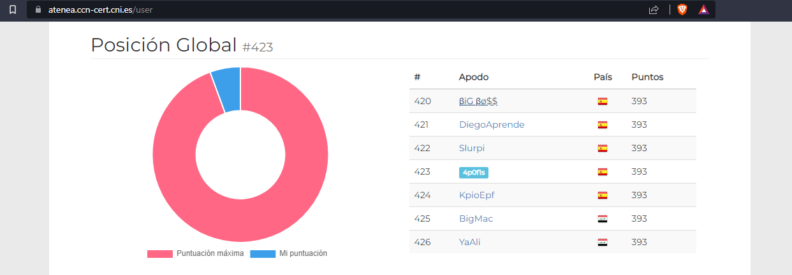

Hi, Im 4p0f1s and my real name is Sergi.

This is my personal blog for update all my things.

### A little more about me

I'm an [ethical hacker] and a cybersecurity enthusiast.
I'm certified in [eJPTv2], and in the way to get the eCPPTv2 cert.

## Platforms Rankings

#### Try Hack Me

#### Hack The Box

<a href="https://app.hackthebox.com/profile/227361">4p0f1s</a>

#### Atenea CCN Cert

## Projects

#### Make The Program

Make the program is a project that we are doing with my partner [Daniel Fraile], It will be a learning programming platform. For now is under development.

#### BTP (Bermuda Triangle Project)

BTP is an idea I've to improve privacy on the internet via VPNs. Stay tuned to learn more about It.

### Contact me

[4p0f1s@protonmail.com](mailto:4p0f1s@protonmail.com)

[eJPTv2]:https://my.ine.com/certificate/1237d554-532a-476a-b322-2b1fcd1c7f02
[ethical hacker]:https://eu.badgr.com/public/assertions/sc39w_K2QCOqjSFcl8uvmQ
[Daniel Fraile]:https://www.youtube.com/channel/UCjEd3L5Rs8qfvA92ADvchAw?app=desktop&cbrd=1
